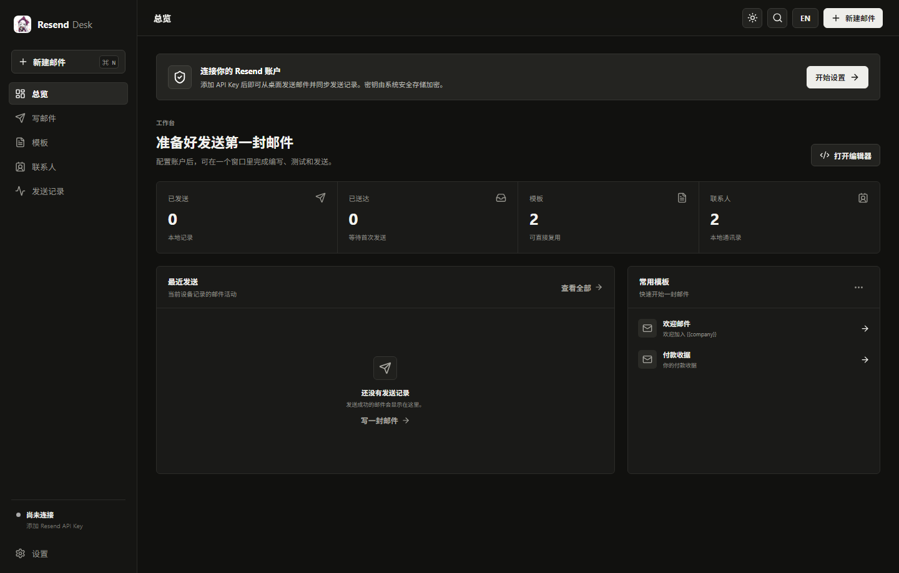

# Resend Desk

## 中文

Resend Desk 是一个面向 Resend 的桌面邮件客户端，使用 **Tauri 2 + Rust + React + TypeScript** 构建。它保留 Resend API 的可控性，同时提供邮件编写、HTML 预览、模板、联系人、发送记录、账户设置和移动端 APK 打包能力。

Rust 后端负责 Resend API 请求、本地数据读写和 API Key 安全存储，前端不直接接触密钥。



### 功能

- Resend API Key 连接测试
- 支持仅发送权限的受限 API Key
- HTML 邮件编辑与沙箱预览
- 输入联系人姓名并选中联系人，快速填充收件人
- 发件人格式和示例域名校验
- 邮件模板管理、JSON 导入与用户选择路径导出
- 本地联系人管理，已保存联系人可再次编辑
- 最近发送记录与关键词搜索
- 发送详情查看，支持预览已发送邮件内容
- 本地统计与远端用量读取
- GitHub 版本检查更新
- 多语言界面：中文 / English
- 浅色与暗色主题
- 可选择本机已安装字体
- Windows Credential Manager 安全保存 API Key
- 自定义应用、安装程序和 Android APK 图标

### 技术栈

- Tauri 2
- Rust 2021
- React 19
- TypeScript
- Vite
- Reqwest
- Windows Credential Manager (`keyring`)

### 开发环境

需要安装：

- Node.js 20 或更高版本
- Rust stable
- Microsoft C++ Build Tools
- WebView2 Runtime

安装依赖：

```powershell
npm install
```

启动桌面开发环境：

```powershell
npm run tauri:dev
```

仅启动浏览器演示模式：

```powershell
npm run dev
```

浏览器模式使用本地模拟数据，不会调用真实 Resend API。

### 构建

构建 Windows NSIS 安装程序：

```powershell
npm run tauri:build
```

构建产物位于：

```text
src-tauri/target/release/bundle/nsis/
```

Android APK 本地构建、签名和 CI 细节见：

```text
CI.MD
```

### GitHub Actions 发布

仓库包含发布工作流：

```text
.github/workflows/build-release.yml
```

支持构建以下产物：

| 平台 | 架构 | 产物 |
| --- | --- | --- |
| Windows | x64 | NSIS `.exe` |
| Windows | x86 | NSIS `.exe` |
| Windows | ARM64 | NSIS `.exe` |
| Android | arm64-v8a | signed `.apk` |

手动构建：

1. 打开 GitHub 仓库的 **Actions** 页面。
2. 选择 **Build release packages**。
3. 点击 **Run workflow**。
4. 构建完成后在 Artifacts 下载对应平台安装包。

发布版本：

```powershell
git tag v0.3.1
git push origin v0.3.1
```

推送 `v*` 标签后，工作流会自动构建 Windows 安装程序和 Android APK，并发布到 GitHub Release。

Android APK 签名需要在 GitHub Secrets 中配置 `ANDROID_KEYSTORE_BASE64`、`ANDROID_KEYSTORE_PASSWORD`、`ANDROID_KEY_ALIAS` 和 `ANDROID_KEY_PASSWORD`。

> 当前工作流不构建 Linux 和 macOS。macOS 正式分发通常还需要 Apple Developer 签名与公证。

### 数据与安全

- API Key 保存到 Windows Credential Manager，服务名为 `com.uf4over.resenddesk`。
- 模板、联系人、设置和本地发送记录保存到 Tauri 应用数据目录。
- 前端通过 Tauri commands 调用 Rust 后端，不会读取 API Key 明文。
- 邮件预览运行在隔离 iframe 中，预览链接不会导航到宿主应用。
- 浏览器演示模式使用本地模拟数据，不会调用真实 Resend API。

### Resend 配置

1. 在 Resend 控制台创建 API Key。
2. 在 Resend Desk 的“设置”页面填写 API Key。
3. 填写已在 Resend 验证的默认发件地址。
4. 测试连接后即可发送邮件。

发件人支持以下格式：

```text
name@example.com
Name <name@example.com>
```

`example.com`、`example.org` 和 `example.net` 仅作为示例域名，客户端会阻止使用这些地址进行真实发送。

### 项目结构

```text
src/                 React 前端
public/              前端静态资源和应用图标
docs/images/         README 和文档截图
src-tauri/src/       Rust 后端
src-tauri/icons/     Windows 应用图标
src-tauri/tauri.conf.json
src-tauri/tauri.android.conf.json
.github/workflows/   GitHub Actions 打包发布工作流
```

### 许可证

本项目基于 GNU General Public License v3.0 发布。详见 [LICENSE](LICENSE)。

---

## English

Resend Desk is a desktop email client for Resend, built with **Tauri 2 + Rust + React + TypeScript**. It keeps the control of the Resend API while adding a focused interface for composing email, previewing HTML, managing templates and contacts, reviewing send history, configuring accounts, and packaging Android APK releases.

The Rust backend handles Resend API requests, local data access, and secure API key storage. The frontend never reads the API key directly.


### Features

- Resend API key connection test
- Support for restricted send-only API keys
- HTML email editor with sandboxed preview
- Type a contact name and select a matched contact to fill recipients quickly
- Sender format validation and sample-domain blocking
- Template management, JSON import, and export to a user-selected path
- Local contact management with editable saved contacts
- Recent send history with keyword search
- Send detail view with sent-email preview
- Local statistics and remote quota usage
- GitHub version update check
- Bilingual UI: Chinese / English
- Light and dark themes
- Local installed font selection
- Secure API key storage through Windows Credential Manager
- Custom app, installer, and Android APK icons

### Stack

- Tauri 2
- Rust 2021
- React 19
- TypeScript
- Vite
- Reqwest
- Windows Credential Manager (`keyring`)

### Development

Requirements:

- Node.js 20 or newer
- Rust stable
- Microsoft C++ Build Tools
- WebView2 Runtime

Install dependencies:

```powershell
npm install
```

Start the desktop development app:

```powershell
npm run tauri:dev
```

Start browser demo mode only:

```powershell
npm run dev
```

Browser demo mode uses local mock data and does not call the real Resend API.

### Build

Build the Windows NSIS installer:

```powershell
npm run tauri:build
```

Output:

```text
src-tauri/target/release/bundle/nsis/
```

For local Android APK build, signing, and CI notes, see:

```text
CI.MD
```

### GitHub Actions Releases

Release workflow:

```text
.github/workflows/build-release.yml
```

Supported packages:

| Platform | Architecture | Artifact |
| --- | --- | --- |
| Windows | x64 | NSIS `.exe` |
| Windows | x86 | NSIS `.exe` |
| Windows | ARM64 | NSIS `.exe` |
| Android | arm64-v8a | signed `.apk` |

Manual build:

1. Open the repository **Actions** page.
2. Select **Build release packages**.
3. Click **Run workflow**.
4. Download the packages from Artifacts after the workflow completes.

Release a version:

```powershell
git tag v0.3.1
git push origin v0.3.1
```

Pushing a `v*` tag automatically builds Windows installers and the Android APK, then publishes them to GitHub Releases.

Android APK signing requires these GitHub Secrets: `ANDROID_KEYSTORE_BASE64`, `ANDROID_KEYSTORE_PASSWORD`, `ANDROID_KEY_ALIAS`, and `ANDROID_KEY_PASSWORD`.

> The current workflow does not build Linux or macOS packages. Official macOS distribution usually requires Apple Developer signing and notarization.

### Data And Security

- API keys are stored in Windows Credential Manager under `com.uf4over.resenddesk`.
- Templates, contacts, settings, and local send history are stored in the Tauri app data directory.
- The frontend calls the Rust backend through Tauri commands and does not read the API key in plain text.
- Email previews run in isolated iframes, and preview links do not navigate the host app.
- Browser demo mode uses local mock data and does not call the real Resend API.

### Resend Setup

1. Create an API key in the Resend dashboard.
2. Enter the API key on the Resend Desk Settings page.
3. Set a default sender address that has been verified in Resend.
4. Test the connection, then send email.

Supported sender formats:

```text
name@example.com
Name <name@example.com>
```

`example.com`, `example.org`, and `example.net` are sample domains only. The client blocks them for real sends.

### Project Structure

```text
src/                 React frontend
public/              Frontend static assets and app icon
docs/images/         README and documentation screenshots
src-tauri/src/       Rust backend
src-tauri/icons/     Windows app icons
src-tauri/tauri.conf.json
src-tauri/tauri.android.conf.json
.github/workflows/   GitHub Actions package and release workflow
```

### License

This project is released under the GNU General Public License v3.0. See [LICENSE](LICENSE).
